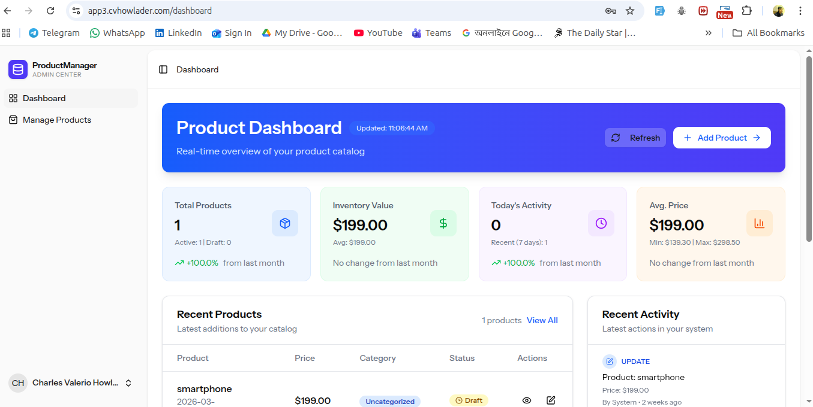
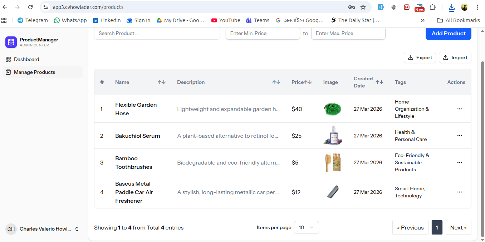
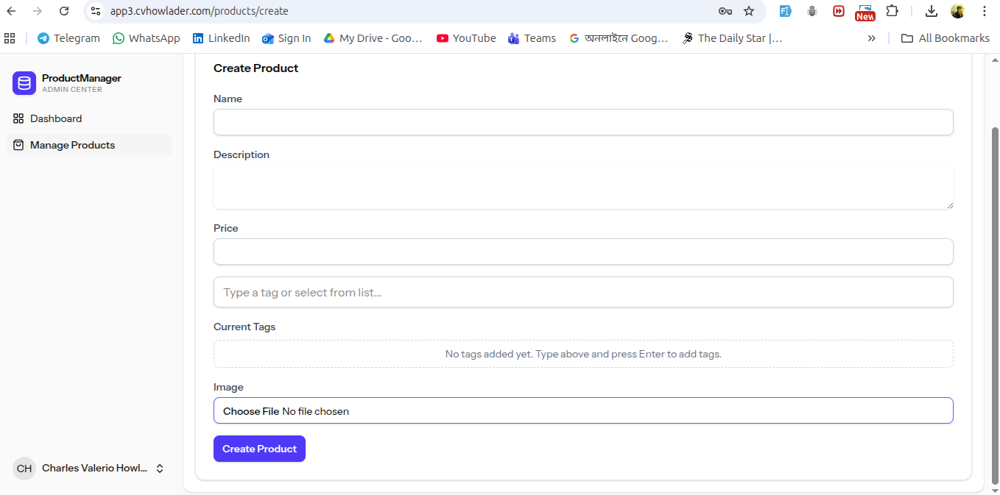
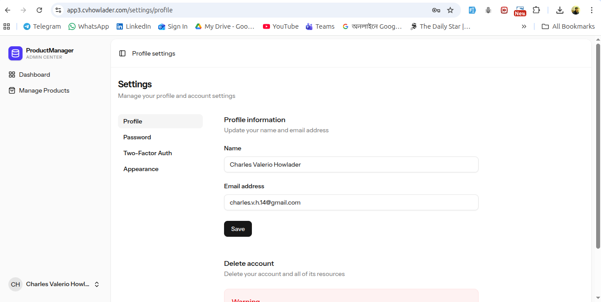
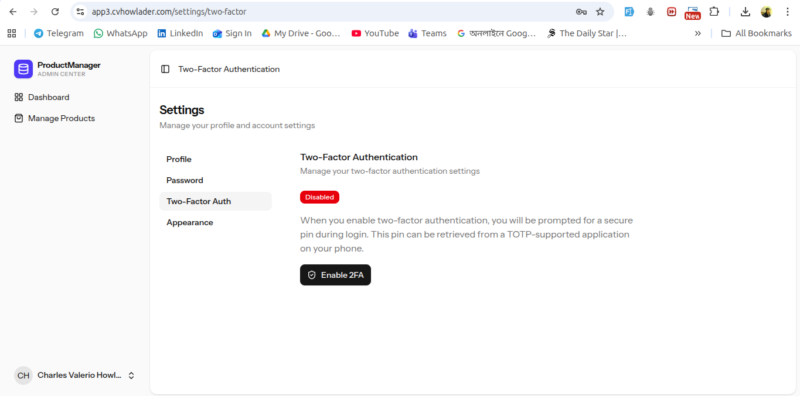

# ProductManager

[](https://laravel.com)
[](https://www.php.net)
[](https://react.dev)
[](https://www.typescriptlang.org)
[](https://tailwindcss.com)
[](https://github.com/features/actions)
[](LICENSE)

ProductManager is a full-stack Laravel + React application for managing products with CRUD operations, dashboard analytics, import/export functionality, and more.

## Live Demo

**Production URL**: [https://app3.cvhowlader.com/](https://app3.cvhowlader.com/)

## Features

- **Product Management** — Full CRUD operations with image upload
- **Dashboard Analytics** — Real-time statistics with interactive charts (price distribution, recent products, activity feed)
- **Import/Export** — Bulk import products from Excel (.xlsx, .xls, .csv) and export filtered data
- **Tag System** — Categorize products with multi-tag support
- **User Authentication** — Secure login/registration via Laravel Fortify
- **Two-Factor Authentication** — Additional security layer for user accounts
- **Blog System** — Public blog with SEO-friendly slugs
- **Dark/Light Theme** — System preference detection with manual toggle
- **Settings** — Profile, password, and appearance management

## Tech Stack

### Backend

- Laravel 12
- PHP 8.2+
- Laravel Fortify (authentication)
- Laravel Wayfinder (routing)
- Maatwebsite Excel (import/export)
- Spatie Sitemap (SEO)

### Frontend

- React 19
- TypeScript
- Vite 7
- Inertia.js (SPA routing)
- Tailwind CSS 4
- Radix UI (accessible components)
- Lucide React (icons)
- Recharts (data visualization)

## Prerequisites

- PHP 8.2 or higher
- Composer
- Node.js 22 or higher
- MySQL, PostgreSQL, or SQLite (for development)
- Git

## Installation

1. **Clone the repository**

    ```bash
    git clone https://github.com/your-username/product-manager.git
    cd product-manager
    ```

2. **Install PHP dependencies**

    ```bash
    composer install
    ```

3. **Install Node dependencies**

    ```bash
    npm install
    ```

4. **Copy environment file**

    ```bash
    cp .env.example .env
    ```

5. **Generate application key**

    ```bash
    php artisan key:generate
    ```

6. **Configure database**
    - Edit `.env` file with your database credentials
    - Run migrations:

    ```bash
    php artisan migrate
    ```

7. **Build assets**

    ```bash
    npm run build
    ```

8. **Start development server**

    ```bash
    php artisan serve
    ```

    Visit `http://localhost:8000` in your browser.

## Environment Variables

Key configuration options in `.env`:

| Variable         | Description      | Default                  |
| ---------------- | ---------------- | ------------------------ |
| `APP_NAME`       | Application name | ProductManager           |
| `APP_URL`        | Application URL  | http://localhost:8000    |
| `DB_CONNECTION`  | Database driver  | sqlite                   |
| `DB_DATABASE`    | Database name    | database/database.sqlite |
| `MAIL_MAILER`    | Mail driver      | log                      |
| `SESSION_DRIVER` | Session driver   | file                     |

## Available Commands

### Development

```bash
# Start development server (Laravel + Vite)
composer run dev

# Start with SSR
composer run dev:ssr

# Run Vite only
npm run dev
```

### Building

```bash
# Build frontend assets
npm run build

# Build with SSR
npm run build:ssr
```

### Testing

```bash
# Run Laravel tests
composer test

# Run PHPUnit
./vendor/bin/phpunit
```

### Code Quality

```bash
# Format PHP code (Pint)
vendor/bin/pint

# Format frontend code (Prettier)
npm run format

# Check frontend formatting
npm run format:check

# Lint frontend code
npm run lint

# TypeScript type checking
npm run types
```

## Project Structure

```
├── app/                    # Laravel application code
│   ├── Actions/           # Fortify user actions
│   ├── Console/          # Artisan commands
│   ├── Exports/          # Excel exports
│   ├── Http/            # Controllers, middleware, requests
│   ├── Imports/         # Excel imports
│   ├── Models/          # Eloquent models
│   └── Providers/       # Service providers
├── database/
│   ├── migrations/      # Database migrations
│   ├── factories/       # Model factories
│   └── seeders/         # Database seeders
├── resources/
│   └── js/              # React frontend
│       ├── components/  # UI components
│       ├── layouts/    # Page layouts
│       ├── pages/      # Inertia pages
│       └── hooks/      # Custom React hooks
├── routes/               # Route definitions
├── tests/                # PHPUnit tests
└── vite.config.ts        # Vite configuration
```

## API Endpoints

### Dashboard

- `GET /api/dashboard/stats` — Dashboard statistics
- `GET /api/dashboard/activity` — Activity log

### Products

- `GET /products` — List products (paginated, filterable)
- `POST /products` — Create product
- `GET /products/{id}` — View product
- `PUT /products/{id}` — Update product
- `DELETE /products/{id}` — Delete product
- `GET /products/export` — Export products to Excel
- `POST /products/import` — Import products from Excel

### Authentication

- `GET /login` — Login page
- `POST /login` — Authenticate
- `POST /logout` — Logout
- `GET /register` — Registration page
- `POST /register` — Register new user

### Settings (authenticated)

- `GET /settings/profile` — Profile settings
- `GET /settings/password` — Password settings
- `GET /settings/two-factor` — 2FA settings
- `GET /settings/appearance` — Appearance settings

### Public Routes

- `/` — Landing page
- `/blog` — Blog index
- `/blog/{slug}` — Blog post
- `/privacy-policy` — Privacy policy
- `/terms-of-service` — Terms of service
- `/cookie-policy` — Cookie policy

## Screenshots

### Dashboard



### Products List



### Product Form



### Settings - Profile



### Settings - Two-Factor Authentication



## Contributing

Contributions are welcome! Please feel free to submit a Pull Request.

1. Fork the repository
2. Create your feature branch (`git checkout -b feature/amazing-feature`)
3. Commit your changes (`git commit -m 'Add some amazing feature'`)
4. Push to the branch (`git push origin feature/amazing-feature`)
5. Open a Pull Request

## License

This project is licensed under the [MIT License](LICENSE).

---

Built with ❤️ using Laravel & React
